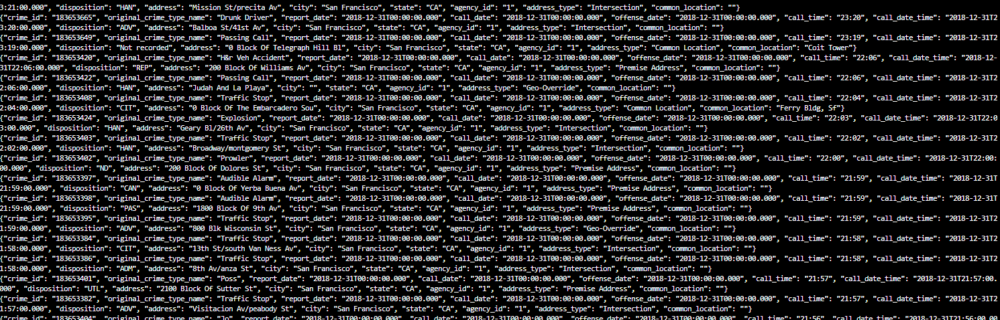
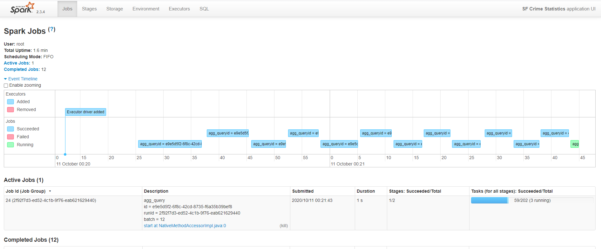
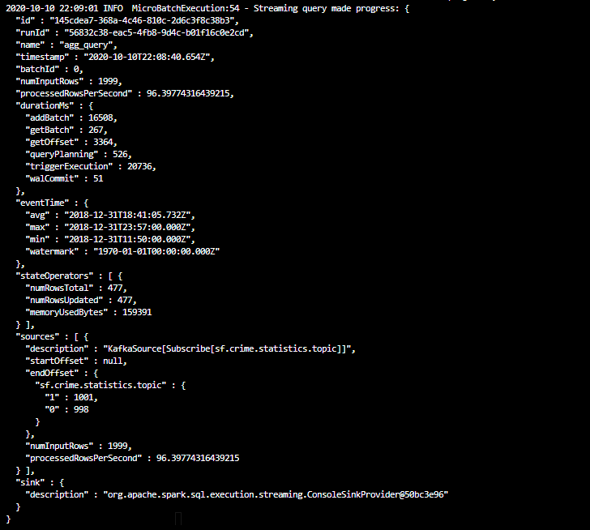
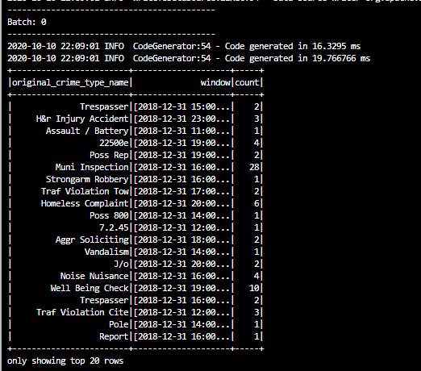

# SF Crime statisticas with Spart Streaming

In this project,  you will analize a real-world dataset of the [SF Crime Rate](https://www.kaggle.com/c/sfcrime), extracted from kaggle, to provide statistical analysis using [Apache Spart Structured Streaming](https://spark.apache.org/docs/latest/structured-streaming-programming-guide.html).

## Summary
1. The files `producer_server.py` and `kafka_server.py` are use to produce records to the topic `sf.crime.statistics.topic`
2. `consumer_server.py` has been created to validate that the `kafka_server.py` is working properly.
3. `data_stream.py` to consume data from Kafka to Apache Spark.

## How to run this project
### step 1
1. Install requirements using `./start.sh` if you use conda for Python. If you use pip rather than conda, then use `pip install -r requirements.txt`

2. Start up these servers in the terminal using the commands (each one on a differente terminal):
```
$ zookeeper-server-start config/zookeeper.properties
$ kafka-server-start config/server.properties
```
3. Execute `kafka_server.py` to produce data for the the topic.
```
$ python kafka_server.py
```
4. Check if the data can be consumed (the data will be present in the console), Execute `consumer_server.py` to validate that the producer is working propertly.
```
$ python consumer_server.py
```
The expected result is the following (Kafka Consumer Console Output):



### step 2
Do a spark-submit using this command:
```
spark-submit --packages org.apache.spark:spark-sql-kafka-0-10_2.11:2.3.4 --master local[*] data_stream.py.
```
you can check the Spark Streaming UI checking the server that you are using and the port number: 3000.
(Spark Streaming UI):

progress reporter after executing a Spark job:


output:


### step 3

1. How did changing values on the SparkSession property parameters affect the throughput and latency of the data?

        It can be adjust using the parameter:  `maxOffsetsPerTrigger` option to limit the number of records to fetch per trigger.  
        By changing the value of `maxOffsetsPerTrigger`, this alterate the 'processedRowsPerSecond'.  Others process can still consuming resources that will slow down the process.

2. What were the 2-3 most efficient SparkSession property key/value pairs? Through testing multiple variations on values, how can you tell these were the most optimal?

        Incrementing the `maxOffsetsPerTrigger` it will expect to get better result, but it depends on the host on which the process is runing, It also depends of the size of the record, in this case the better results where at 2,000.  It there are more resources, I expect to get better results increasing the `maxOffsetsPerTrigger`


